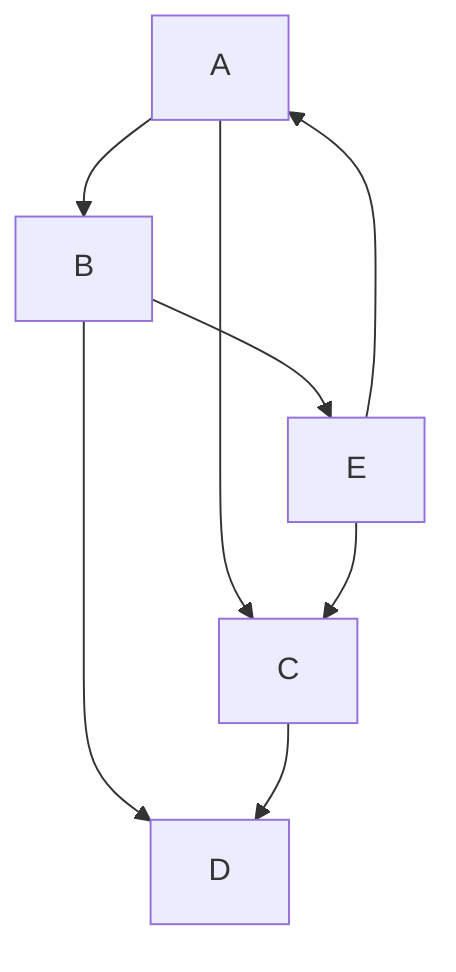

# Hola Mundo

##Edits en Readme con MarkDown

###vamos a hacer un texto donde mezclaremos los estilos de fuente.

**1. La negrita**

*2. Itálica*

~~3. tachado~~


**En un texto en negrita podemos escribir algo en _itálica_ en medio de él .**

***O hacer que todo el texto sea negrita e itálica.***

Otros estilos son usar el <sub>Texto de subindice</sub>

O también su contraparte, el <sup>Texto de superindice</sup>


> Tambien podemos hacer citas en los textos

Ejemplo de dar formato propio a una lista:
```
git status
git add
git commit
```


Hay 3 formas para visualizar colores[^note].

+ El modo HEX `#0d1117`
* El modo RGB `rgb(255,100,35)`
- El modo HSL `hsl(193,55%,3%)` 

Para insertar links solo tenemos que poner la URL entre parentesis, tambien podemos editar como se ve si ponemos el texto que queremos ver entre corchetes [Página web de GitHub](https://pages.github.com/)

Una imagen nostálgica:


Ejemplo de insertar imagen con fondo transparente adaptativo al dark mode o light mode de la pagina web:
<picture>
  <source media="(prefers-color-scheme: dark)" srcset="https://user-images.githubusercontent.com/25423296/163456776-7f95b81a-f1ed-45f7-b7ab-8fa810d529fa.png">
  <source media="(prefers-color-scheme: light)" srcset="https://user-images.githubusercontent.com/25423296/163456779-a8556205-d0a5-45e2-ac17-42d089e3c3f8.png">
  
</picture>

1. Ya estuvimos haciendo listas en este readme.
  - Pero tambien podemos hacer sublistas
    - Incluso sublistas de las sublistas. Tantas sublistas son necesarias?
      - [ ] Si
      - [ ] Evidentemente
      - [X] No hay que poner limites

:cry: Pongo un emoji llorando porque no funcionan los pies de página.

<!-- ALERTA SPOILER-->


